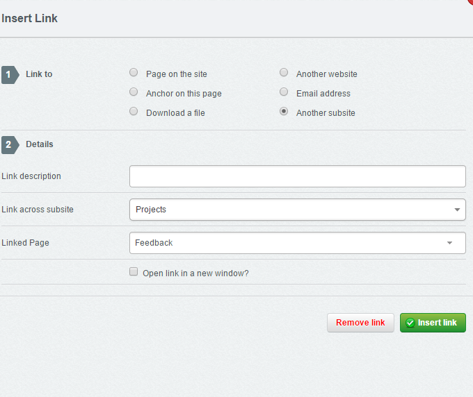
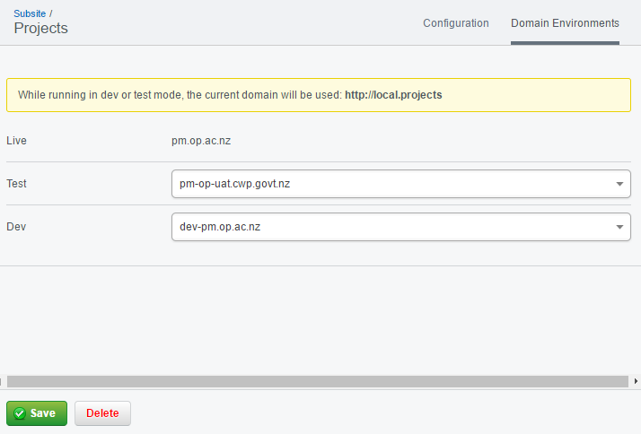

# Making it easier to manage multiple domains (subsites)

This add-on makes allows you to easily link
to other subsites in the CMS, set dev and test domains, and override domains in
your configuration file.

# Features 

**Create a link to a different subsite in the CMS**



**Create virtual pages that have their own template**

https://github.com/silverstripe/silverstripe-subsites/issues/235

**Access the CMS interface by navigating to subsite.domain/admin**

You'll be redirected to the main SilverStripe interface if trying to access /admin
 on a subsite. 

**Set different domains for Test and Dev mode in the CMS**



**Override local development domains in your config file**

This makes it handy while developing your SilverStripe domains locally. Because 
developers have different preferences for their domain naming conventions, this
lets them set it to what they want. All while not disturbing the main dev and test
site settings. 

In *_ss_environment.php*:

```php
define('DEV_SUBSITE_0', 'https://maindev.company.domain');
define('DEV_SUBSITE_1', 'http://local.project1');
define('DEV_SUBSITE_2', 'http://local.project2');
define('DEV_SUBSITE_3', 'http://local.project3');

// instead of setting it different places, you can just do it once
global $_FILE_TO_URL_MAPPING;
$_FILE_TO_URL_MAPPING['C:\\apache\\htdocs\\op'] = DEV_SUBSITE_0;

// ... etc.
```

Optional: in your _config.php file

```
Object::add_extension('HtmlEditorField_Toolbar', 'HtmlEditorField_ToolbarExtension');
ShortcodeParser::get('default')->register('subsite_link', array('HtmlEditorField_ToolbarExtension', 'link_shortcode_handler'));
```

This will enable the subsite linking to work in the CMS.

**Bypass the stage while accessing a subsite**

If you try to access a subsite from the CMS, you'll be redirected to authenticate.
This will fail if you're using a single sign in solution. As a result, stage= is blank.


